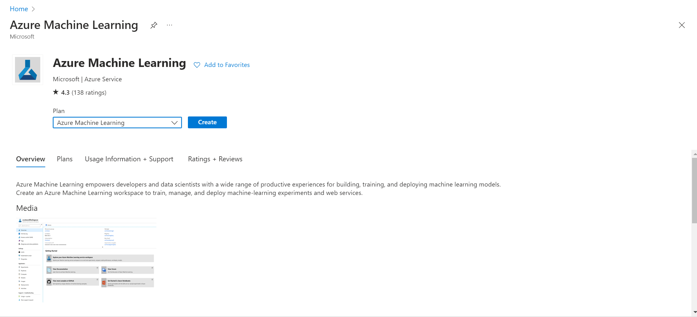

# Data Science Phase 2 Task 3

Welcome to Phase 2 Task 3! Congratulations for making it so far. Microsoft Azure is a cloud computing platform and service provided by Microsoft. For this task, you will learn how data scientists deploy machine learning models via the machine learning service in Microsoft's Azure.

Feel free to take a look at [here](https://docs.microsoft.com/en-us/azure/machine-learning/how-to-deploy-and-where?tabs=azcli) if you're not familiar with the concept of deployment in Azure.

# Prerequisites
1. An Azure account. If you don't have an Azure subscription, [create a free account](https://azure.microsoft.com/en-us/free/) before you begin.
2. Python or Anaconda
3. ```pip install azureml-core```

## Getting Started:
Firstly, we need to setup Azure to host our machine learning model:

1. Go to [Microsoft Azure portal page](https://azure.microsoft.com/en-us/get-started/azure-portal)


2. Create a resource and search for 'Azure Machine Learning' 




3. Create the Machine Learning resource by filling in the details. Make sure you select the right region as **'Australia East'**. Other than that, you can name whatever they make sense to your project.


4. Click 'Review + Create'. After validation, it would take you to the deployment page. It would take around 1 minute for the whole deployment process. Wait till it show **'Your deployment is complete'**.


5. Click 'Go to resources' and then click 'Launch studio'. This would take you the Machine Learning studio, which is a visual development environment for creating, testing, and deploying machine learning models without extensive coding. It offers pre-built modules, a drag-and-drop interface, experiment tracking, collaboration features, and integration with other Azure services.


## Task steps:


## Datasets lists:


## Submission Requirements:
