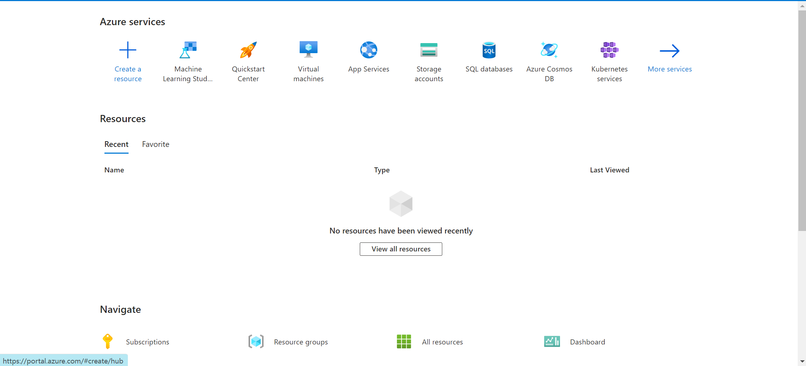
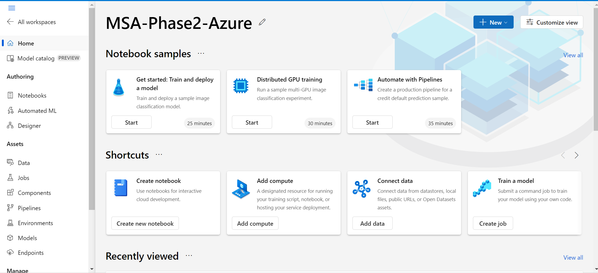

# Part 3 - Microsoft Azure

Welcome to the third and final part of Phase 2 Data Science! This part will involve you doing (almost) everything you've done in the first two parts in the cloud! 

Microsoft's cloud computing platform is called Azure and this part will specifically focus on Azure Machine Learning, a service within Azure that allows you to do everything from running Jupyter notebooks and training machine learning models in the cloud to logging evaluation metrics across multiple iterations of model development and deploying models from within the Azure portal (i.e. the website you'll use to access Azure from your web browser) or from your own code.

We hope you find that doing data science in the cloud makes several things easier and faster to accomplish while unlocking some useful features that can help you as a data scientist deliver more value in less time! The features within Azure Machine Learning that this part will focus on are:

- **Notebooks** for saving and executing Jupyter notebooks
- **AutoML** for automatically training and tuning models
- **Runs** for tracking and visualising evaluation metrics like precision, recall, ROC, AUC etc.
- **Deployment** for putting models into production using Docker containers from either the Azure portal or an IDE

- AutoML (finding best model via experiments with different features, algorithms, and parameters)
- Designer (no-code)
- Runs (logging of hyperparameters and other settings across multiple experiments consisting of 1 or more runs, and visualisations of metrics) 
- Jobs (running scripts to e.g. tune hyperparameters, run a pipeline etc) 
- Pipelines (out-of-the-box or customisable workflows for data prep, train, test, deployment) 
- Workspaces (needed in order to run Azure ML Studio I.e. the “browser” version of Azure ML, setup part of a module)

## Getting Started

1. Before starting the tasks below, ensure that you have signed up for an Azure for Students subscription using the [Microsoft Azure Sign-Up Instructions](https://github.com/NZMSA/2023-Phase-2#microsoft-azure-sign-up-instructions).

- Create workspace: https://portal.azure.com/#create/Microsoft.MachineLearningServices

## Tasks

- Train and evaluate one model that you developed in the first two parts (either for your chosen classification dataset or regression dataset)
- Create and run training script 
- Register a model

## Submission

TBC by Mon 3 July

To be determined after researching what can be shared outside of Azure with us e.g. their entire workspace (ideal, so that we can see everything they’ve done) 

## Marking Criteria

- Upload the model to Azure Machine Learning Studio and expose the model as an API which can accept a row of data like the one present in your chosen dataset and output a classification/regression result back to the user.
- Deploy your model

You will need to submit a link to your Azure Notebook (make sure it's set to public) to us for marking.


## Tips

TBC by Mon 3 July


## Getting Started:
Firstly, we need to setup Azure to host our machine learning model:

1. Go to [Microsoft Azure portal page](https://azure.microsoft.com/en-us/get-started/azure-portal)



2. Create a resource and search for 'Azure Machine Learning' 


3. Create the Machine Learning resource by filling in the details. Make sure you select the right region as **'Australia East'**. Other than that, you can name whatever they make sense to your project.


4. Click 'Review + Create'. After validation, it would take you to the deployment page. It would take around 1 minute for the whole deployment process. Wait till it show **'Your deployment is complete'**.


5. Click 'Go to resources' and then click 'Launch studio'. This would take you the Machine Learning studio, which is a visual development environment for creating, testing, and deploying machine learning models without extensive coding. It offers pre-built modules, a drag-and-drop interface, experiment tracking, collaboration features, and integration with other Azure services.




## Model Training:

Before we deploy our model we would first need to train one. In this example, I trained a XGBoost model on the well known iris dataset. 

For task 3, you are allowed to choose one dataset to train in the dataset list. If you are stuck you can access the [Official Microsoft Documentation](https://docs.microsoft.com/en-us/azure/machine-learning/how-to-deploy-and-where?tabs=azcli) which will guide you to deploying any type of machine learning model.

Feel free to use this sample code and practice how to train a model then deploy it :)

```python
# Example model training on the iris dataset 
# Load libraries for creating a xgboost model of the iris dataset 
from sklearn import datasets
from sklearn.model_selection import train_test_split
from xgboost import XGBClassifier

# Load the data 
iris = datasets.load_iris() 
X = iris.data                
y = iris.target      

# Split data into test and train 
X_train, X_test, y_train, y_test = train_test_split(X, y, test_size = 0.2, random_state = 42)

# Create XGBoost classifier and save model 
xgbClf = XGBClassifier(use_label_encoder = False)
xgbClf.fit(X_train, y_train)
xgbClf.save_model("model.json")
```


## Model Deployment:

Assuming that we have a fully trained machine learning model, we can deploy it in Python(you can decide either Jupter Notebook or local) or online through the Machine Learning Studio. Deploying via Python code is easier and more well documented, so I recommend you do that. 

1. First we need the azureml-core Python module. Install this in a command window of your choice 

   ```pip install azureml-core``` 

2. Navigate to the azure portal and find the machine learning resource that you created earlier and download the ```config.json``` file. Save this to your working directory as we will need this config file to connect our machine learning workspace and deploy our model.


3. Connect to our workspace

```python
# Load workspace 
from azureml.core import Workspace
ws = Workspace.from_config(path = "config.json")
print(ws)
```
If you run this code in Jupyter Notebook, it should open a web browser window where you have to sign-in to Azure. Follow the instructions there and you should see an output Workspace.create(...) if you connected successfully. 

4. Register our model that we saved earlier with the appropriate model name 

```python
from azureml.core.model import Model

# Register model
model = Model.register(ws, model_name = "iris-xgboost", model_path = "model.json")
```

5. Registering the model merely uploads a model file onto the cloud, but there is no code/instructions to interface with it. We need to create an entry script file (scoring file) that will run when we receive data. This file should load the model, process the data and return the model's response to the client. ***The script is therefore specific to your model***. According to the documentation, the entry script requires two things:

   1. Loading your model using a function called ```init()```
   2. Running model on the input data using a function called ```run()```

   For our iris example, we would do something like this 

   ```python
   # Load libraries 
   import json
   import os 
   import numpy as np
   from xgboost import XGBClassifier
   
   # Since model works with label encoded data, we can create a dictionary to get the acutal class names
   classes = {0: "setosa", 1: "versicolor", 2: "virginica"}
   
   # 1. Requried init function
   def init():
       # Create a global variable for loading the model
       global model
       model = XGBClassifier(use_label_encoder = False)
       model.load_model(os.path.join(os.getenv("AZUREML_MODEL_DIR"), "model.json"))
   
   # 2. Requried run function
   def run(request):
       # Receive the data and run model to get predictions 
       data = json.loads(request)
       data = np.array(data["data"])
       res = model.predict(data)
       return [classes.get(key) for key in res]
   ```

   ***For your project, you must be able to write an entry script that works specifically to your model.*** 

6. After registering our model, we need to setup the remote virtual environment. Under the hood, Microsoft is creating a docker containing that contains our Python environment running our model. Interfacing with our model is achieved via REST API. 

   1. We want the remote environment to have exactly the same Python versions/modules as our local machine. I have noticed that using the ```Environment.from_existing_conda_environment()``` method results in deployment errors, but is the easiest way so try this first.
   2. If you are receiving deployment errors then try the second method which is to manually add packages as required.

```python
from azureml.core import Environment
from azureml.core.conda_dependencies import CondaDependencies
from azureml.core.model import InferenceConfig

# 1. Create environment from existing conda environment 
env = Environment.from_existing_conda_environment(name = "iris-xgboost",
                                                conda_environment_name = "azure")

# 2. Create environment 
env = Environment(name = "iris-xgboost")
conda_dep = CondaDependencies()
conda_dep.add_conda_package("numpy")
conda_dep.add_conda_package("xgboost")
env.python.conda_dependencies = conda_dep

dummy_inference_config = InferenceConfig(
    environment = env,
    source_directory = "./source_dir",
    entry_script = "./echo_score.py",
)
```

7. Now we are ready to deploy our model!

```python
from azureml.core.webservice import AciWebservice
# NOTE: You may need more CPU or memeory depending on what kinds of model you end up using
aci_config = AciWebservice.deploy_configuration(cpu_cores = 1, memory_gb = 1)
service = Model.deploy(
    ws,
    "iris-xgboost",
    [model],
    dummy_inference_config,
    aci_config,
    overwrite = True,
)
service.wait_for_deployment(show_output = True)
```

Once the model has been deployed, you should be able to see it under the endpoints tab in the Azure ML studio.

8. We can use any tool now to test our endpoint using REST API calls. If it returns data then you have successfully deployed and hosted your very first ML model! 

For example, for testing in python:
```python
import requests
import json

uri = service.scoring_uri
requests.get("http://16a75b9c-e6cc-47cd-89f6-215e077c43a9.australiaeast.azurecontainer.io/score")
headers = {"Content-Type": "application/json"}
data = {
    "data": [[6.1, 2.8, 4.7, 1.2]],
}
data = json.dumps(data)
response = requests.post(uri, data = data, headers = headers)
print(response.json())
```

***NOTE: You may want to stop the container instance that hosts your model when not in use because it costs money to host the model.***

***Just find the container instance of your model and press the stop button. You can press start whenever you want to use your model.***